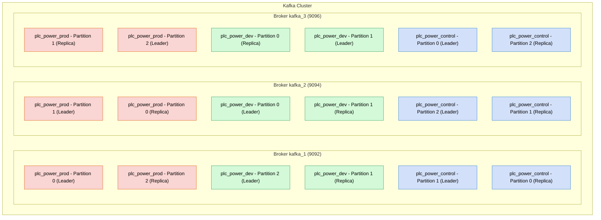

```mermaid
flowchart TB
    classDef prod fill:#f9d5d3,stroke:#e36414,color:#000
    classDef dev fill:#d3f9d8,stroke:#38a169,color:#000
    classDef control fill:#d3e0f9,stroke:#3182ce,color:#000

    subgraph Cluster["Kafka Cluster"]
        direction LR

        subgraph Broker1["Broker kafka_1 (9092)"]
            P0["plc_power_prod - Partition 0 (Leader)"]:::prod
            P2["plc_power_prod - Partition 2 (Replica)"]:::prod
            D2["plc_power_dev - Partition 2 (Leader)"]:::dev
            D3["plc_power_dev - Partition 1 (Replica)"]:::dev
            C1["plc_power_control - Partition 1 (Leader)"]:::control
            C0["plc_power_control - Partition 0 (Replica)"]:::control
        end

        subgraph Broker2["Broker kafka_2 (9094)"]
            P1["plc_power_prod - Partition 1 (Leader)"]:::prod
            P0r["plc_power_prod - Partition 0 (Replica)"]:::prod
            D0["plc_power_dev - Partition 0 (Leader)"]:::dev
            D1["plc_power_dev - Partition 1 (Replica)"]:::dev
            C2["plc_power_control - Partition 2 (Leader)"]:::control
            C1r["plc_power_control - Partition 1 (Replica)"]:::control
        end

        subgraph Broker3["Broker kafka_3 (9096)"]
            P1r["plc_power_prod - Partition 1 (Replica)"]:::prod
            P2l["plc_power_prod - Partition 2 (Leader)"]:::prod
            D0r["plc_power_dev - Partition 0 (Replica)"]:::dev
            D1l["plc_power_dev - Partition 1 (Leader)"]:::dev
            C0l["plc_power_control - Partition 0 (Leader)"]:::control
            C2r["plc_power_control - Partition 2 (Replica)"]:::control
        end
    end
```